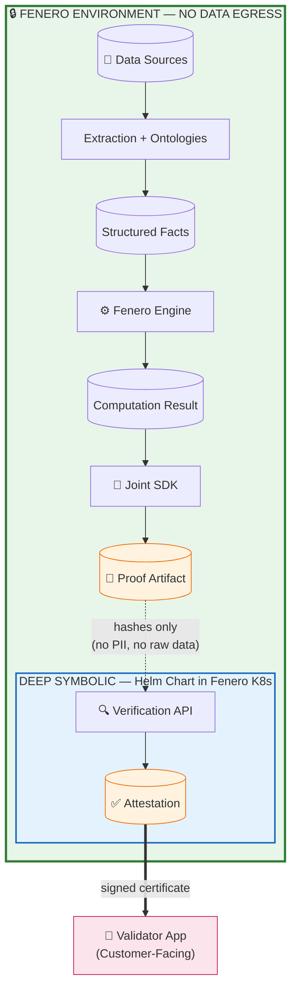

# Fenero + Deep Symbolic: Provable Compute

**Version:** 0.1.0 (Draft)
**Date:** 2026-01-04
**Status:** Proposal for Partnership Discussion

---

## Overview

This repository contains the design documentation for the joint Fenero + Deep Symbolic integration for **mathematically provable computation verification**.

**Core Principle:** Deep Symbolic Verification API runs inside Fenero's Kubernetes cluster via Helm. **NO DATA** leaves Fenero's environment.

---

## Architecture

---

## Components

| Component                 | Owner           | IP                                   | Purpose                                      | Details                                       |
|---------------------------|-----------------|--------------------------------------|----------------------------------------------|-----------------------------------------------|
| **Proof Generation SDK**  | Joint           | Fenero (integration work, paid for)  | Generate formal proofs from computation results | [SDK Interface](design/02-sdk-interface.md)   |
| **Verification API**      | Deep Symbolic   | Deep Symbolic                        | Verify proofs, issue signed attestations     | [Verification API](design/03-verification-api.md) |
| **Validator App**         | Fenero          | Fenero (integration work, paid for)  | Customer-facing UI for attestation display   | [Validator App](design/07-validator-app.md)   |

---

## Design Documents

| Document | Description |
|----------|-------------|
| [01-architecture.md](design/01-architecture.md) | System architecture, data flow, deployment model |
| [02-sdk-interface.md](design/02-sdk-interface.md) | SDK API specification (ProofGenerator, ProofArtifact) |
| [03-verification-api.md](design/03-verification-api.md) | Deep Symbolic verification endpoints |
| [04-proof-backends.md](design/04-proof-backends.md) | Z3/Lean/Coq analysis and recommendation |
| [05-security-model.md](design/05-security-model.md) | Trust model, signature chain, key management |
| [06-open-questions.md](design/06-open-questions.md) | Decisions needed for partnership kickoff |
| [07-validator-app.md](design/07-validator-app.md) | Certificate UI, privacy tiers, accept/reject workflow |

---

## Key Decisions

### Proof Backend: Z3 (Phase 1)

Start with Z3 SMT solver for arithmetic proofs. See [proof backend analysis](design/04-proof-backends.md).

### On-Premise Deployment

Deep Symbolic provides Helm chart for Kubernetes deployment. No data egress.

### Ontology System

Multi-layer ontology support:
- **MISMO 3.4** - Standard mortgage documents
- **IRS Extended** - Tax schedules (C, E, K-1, 1065, 1120)
- **Employment** - VOE forms, pay stubs

---

## Privacy Model

| Data | Crosses Boundary? |
|------|-------------------|
| PII (SSN, names) | NO |
| Raw documents | NO |
| Dollar amounts | NO (hash only) |
| Formula content | NO (hash only) |
| Proof artifact | YES |
| Attestation | YES |

---

## Next Steps

1. Align on proof system (Z3 recommended)
2. Set up joint SDK repository
3. Select 2-3 specs for proof-of-concept
4. End-to-end integration test
5. Security review

---

## References

- [Z3 Theorem Prover](https://github.com/Z3Prover/z3)
- [SMT-LIB Standard](http://smtlib.cs.uiowa.edu/)
- [Lean 4](https://leanprover.github.io/)
