# Fenero + Deep Symbolic: Integration Design

**Version:** 0.1.0 (Draft)
**Date:** 2026-01-04
**Status:** Proposal for Partnership Discussion

---

## Executive Summary

This document outlines the integration between Fenero (execution engine) and Deep Symbolic for mathematically provable computation verification.

**Partnership produces three components:**

| Component                | Owner                              | Purpose                                                        | IP             |
|--------------------------|------------------------------------|----------------------------------------------------------------|----------------|
| **Proof Generation SDK** | **Joint (Fenero + Deep Symbolic)** | Library that generates formal proofs from computation results   | Fenero (Paid integration work)       |
| **Verification API**     | **Deep Symbolic**                  | Service that verifies proofs and issues signed attestations     | Deep Symbolic  |
| **Validator App**        | **Fenero**                         | Customer-facing UI powered by Deep Symbolic verification        | Fenero         |

**Key Requirements:**
- SDK is co-developed and publicly availble for package managers
- Non-invasive to Fenero's existing pipeline
- Proof system TBD (Z3, Lean, Coq, etc. - to be decided jointly)

---

## Architecture Overview

```mermaid
flowchart TB
    subgraph FENERO["FENERO SYSTEM (Secure, On-Premise)"]
        DATA[Data Sources<br/>(Documents)] --> EXT[Extraction Pipeline<br/>+ Ontologies]
        ONTOLOGY[(Ontology Registry<br/>MISMO / IRS / Employment)] --> EXT
        EXT --> FACTS[Structured Facts<br/>with Ontology Refs]
        FACTS --> ENGINE[Fenero Underwriter Engine<br/>(CEL Formulas)]
        ENGINE --> RESULT[ComputationResult<br/>+ Derivations + Evidence]

        RESULT -.->|"optional, async"| SDK

        subgraph SDK["JOINT SDK: provable-compute"]
            GEN[Proof Generator]
        end

        SDK --> ARTIFACT[ProofArtifact]
    end

    ARTIFACT -->|hashes + signatures only| VERIFY

    subgraph DS["DEEP SYMBOLIC (Helm-deployed in Fenero K8s)"]
        VERIFY[Verification API<br/>POST /verify]
        VERIFY --> ATTEST[Attestation<br/>+ Signature]
    end

    ATTEST --> VALIDATOR[Fenero Validator App<br/>Customer-facing]
```

**Critical:** Deep Symbolic Verification API runs inside Fenero's Kubernetes cluster via Helm. NO DATA leaves Fenero's environment.

---

## Component 1: Proof Generation SDK (Joint Development)

### Ownership Model


### Purpose

Co-Developed library that converts computation results into verifiable formal proof artifacts. Agnostic any execution engine.

### Integration Point

```python
# Fenero computation (unchanged)
result = engine.evaluate(inputs, context)

# NEW: Optional post-processing (async, non-blocking)
from provable_compute import ProofGenerator

proof_gen = ProofGenerator()
proof_artifact = proof_gen.generate_proof(
    formulas=result.derivations,
    inputs=result.inputs,
    outputs=result.outputs,
    metadata={"spec": "income_calculation", "version": "2025.1.0"}
)
```

### SDK Interface

```python
class ProofGenerator:
    """Joint SDK - Proof generation from computation results."""

    def __init__(self, backend: str = "auto"):
        """
        Args:
            backend: Proof system backend - "z3", "lean", "coq", or "auto"
        """
        pass

    def generate_proof(
        self,
        formulas: dict[str, str],    # Derivation formulas
        inputs: dict[str, Any],      # Input values
        outputs: dict[str, Any],     # Computation results
        metadata: dict,              # Identification
        sign: bool = True            # Sign the proof artifact
    ) -> ProofArtifact:
        """
        Generate formal proof from computation.

        Returns:
            ProofArtifact ready for verification
        """
        pass


@dataclass
class ProofArtifact:
    """Output from SDK - ready for verification API."""

    proof_id: str
    timestamp: datetime
    backend: str                   # "z3" | "lean" | "coq" | etc.

    # Hashes (for privacy)
    inputs_hash: str               # Hash of input values
    formula_hash: str              # Hash of derivation formulas
    result_hash: str               # Hash of computation result

    # Proof content
    proof_content: bytes           # Backend-specific proof artifact
    proof_format: str              # "smt2" | "lean4" | "gallina" | etc.

    # Signatures
    generator_signature: bytes     # SDK signs the proof generation

    def to_verification_request(self) -> dict:
        """Format for Deep Symbolic Verification API."""
        pass
```

### Example: Arithmetic Verification

```python
# Computation formulas
formulas = {
    "pct_change": "(y1 - y2) / y2",
    "is_stable": "pct_change >= -0.05"
}
inputs = {"y1": 60000, "y2": 50000}
outcome = "STABLE"

# SDK generates proof (backend-specific)
# Example: SMT2 format
"""
(declare-const y1 Real)
(declare-const y2 Real)
(declare-const pct_change Real)

; Input constraints
(assert (= y1 60000.0))
(assert (= y2 50000.0))

; Derivation: pct_change = (y1 - y2) / y2
(assert (= pct_change (/ (- y1 y2) y2)))

; Threshold check: is_stable = pct_change >= -0.05
(assert (>= pct_change -0.05))

(check-sat)  ; Expected: sat (outcome = STABLE)
"""
```

---

## Component 2: Deep Symbolic Verification API

### Endpoint: Verify Proof

**`POST /api/v1/verify`**

```mermaid
sequenceDiagram
    participant F as Fenero
    participant SDK as Joint SDK
    participant API as Deep Symbolic API

    F->>SDK: generate_proof(result)
    SDK->>SDK: Translate formula → proof
    SDK->>SDK: Sign artifact
    SDK-->>F: ProofArtifact

    F->>API: POST /verify
    API->>API: Validate signatures
    API->>API: Verify proof soundness
    API->>API: Issue attestation
    API-->>F: Attestation + Signature
```



#### Request

```json
{
  "proof_id": "uuid",
  "timestamp": "2026-01-04T12:00:00Z",

  "spec": {
    "name": "income_calculation",
    "version": "2025.1.0",
    "hash": "sha256:..."
  },

  "inputs_hash": "sha256:...",
  "result_hash": "sha256:...",
  "formula_hash": "sha256:...",

  "proof_content": "base64-encoded-proof",
  "proof_format": "smt2",
  "backend": "z3",

  "generator_signature": "base64:..."
}
```

#### Response

```json
{
  "verification_id": "uuid",
  "status": "VERIFIED",

  "checks": {
    "signature_valid": true,
    "proof_sound": true,
    "hashes_consistent": true
  },

  "attestation": {
    "statement": "Computation mathematically verified",
    "signature": "base64:deep-symbolic-signature",
    "issued_at": "2026-01-04T12:00:05Z",
    "expires_at": "2027-01-04T12:00:05Z"
  }
}
```

### Endpoint: Get Attestation

**`GET /api/v1/attestation/{verification_id}`**

Returns the stored attestation for audit/display.

### Endpoint: Batch Verify

**`POST /api/v1/verify/batch`**

For verifying multiple computations in a single request.

---

## Integration Modes

### Mode A: Synchronous (Simple)

```python
result = engine.evaluate(inputs)

# Generate proof and verify immediately
proof = proof_gen.generate_proof(result)
attestation = proof_gen.verify(proof)

case.attestation = attestation
```

### Mode B: Async Post-Processing (Recommended)

```python
result = engine.evaluate(inputs)
save_result(result)  # User sees result right away

# Background task generates proof
@background_task
def generate_and_verify(result_id):
    result = load_result(result_id)
    proof = proof_gen.generate_proof(result)
    attestation = proof_gen.verify(proof)
    save_attestation(result_id, attestation)
```

---

## Data Visibility Matrix

| Data Type | Fenero | Joint SDK | Verify API | Validator App |
|-----------|--------|-----------|------------|---------------|
| PII (SSN, Name) | Yes | No | No | No |
| Raw Documents | Yes | No | No | No |
| Structured Facts | Yes | No | No | No |
| Input Values ($) | Yes | Yes | hash only | hash only |
| Formulas | Yes | Yes | hash only | display |
| Proof Artifact | Yes | Yes | Yes | hash only |
| Attestation | Yes | No | Yes | Yes |
| Signatures | Yes | Yes | Yes | Yes |

---

## Signature Chain


---

## Open Questions (For Joint Discussion)

### 1. Proof System Selection

| System | Pros | Cons |
|--------|------|------|
| **Z3 (SMT)** | Fast, mature, good for arithmetic | Limited expressiveness |
| **Lean 4** | Modern, growing ecosystem | Steeper learning curve |
| **Coq** | Battle-tested, strong guarantees | Verbose, slower |
| **Custom DSL** | Tailored to our needs | Build/maintain burden |

**Recommendation:** Start with Z3 for arithmetic proofs, evaluate Lean for complex logic.

### 2. SDK Architecture

- Library only (local execution)?
- Service only (API call)?
- Hybrid (library for generation, service for heavy verification)?

### 3. Verification Service

- What uptime SLA is needed?
- Proof storage: temporary or permanent?
- Should specs be pre-registered?

### 4. Security

- Who issues signing certificates?
- Key rotation procedures?
- HSM requirements?

### 5. Pricing & Business

- Per-verification pricing?
- Subscription model?
- Volume discounts?

---

## Expression Translation Coverage

The SDK must translate computation expressions:

| Expression | Description | Priority |
|------------|-------------|----------|
| `a + b` | Addition | P0 |
| `a - b` | Subtraction | P0 |
| `a * b` | Multiplication | P0 |
| `a / b` | Division | P0 |
| `a >= b` | Greater or equal | P0 |
| `a <= b` | Less or equal | P0 |
| `a == b` | Equality | P0 |
| `a && b` | Logical AND | P0 |
| `a \|\| b` | Logical OR | P0 |
| `!a` | Logical NOT | P0 |
| `a ? b : c` | Ternary | P1 |
| `max(a, b)` | Maximum | P1 |
| `min(a, b)` | Minimum | P1 |
| `abs(a)` | Absolute value | P1 |

---

## Next Steps

1. **Align on proof system** - Joint meeting to decide Z3 vs alternatives
2. **SDK repo setup** - Create joint repository with initial structure
3. **PoC spec selection** - Fenero identifies 2-3 computation specs for proof-of-concept
4. **Expression translator** - Build translation layer for priority expressions
5. **Integration test** - End-to-end with sample calculation
6. **Security review** - Signature chain and key management

---

## References

- [Z3 Theorem Prover](https://github.com/Z3Prover/z3)
- [Lean 4](https://leanprover.github.io/)
- [SMT-LIB Standard](http://smtlib.cs.uiowa.edu/)
