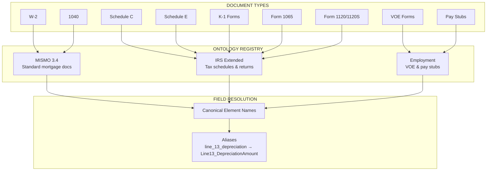
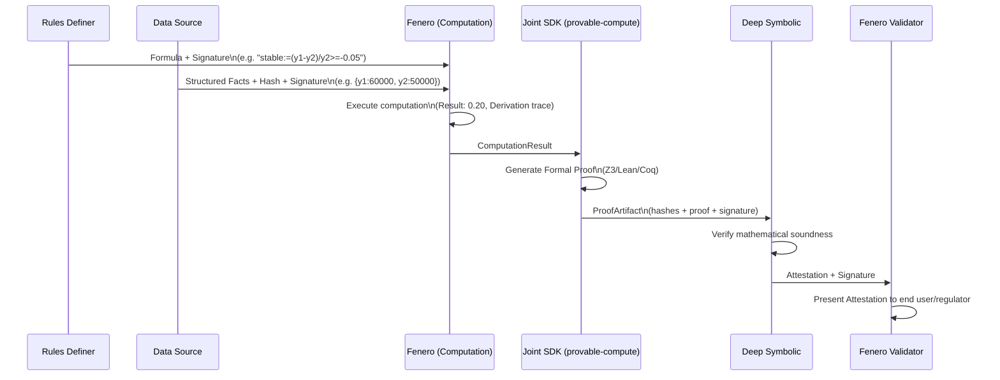

# System Architecture

**Status:** Draft for Joint Review  
**Last Updated:** 2026-01-04

---

## Overview

This document details the technical architecture for the Fenero + Deep Symbolic integration. The system enables mathematically provable computation verification without exposing sensitive data.

---

## Core Principle

```mermaid
flowchart TD
    FE[Fenero executes computations & generates proofs]
    DS[Deep Symbolic verifies proofs & issues attestations]
    NODATA[NO DATA leaves Fenero environment (on-prem verification)]
    FE --> DS
    FE --> NODATA
```

**Critical Requirement:** The Deep Symbolic Verification API must be deployable within Fenero's Kubernetes cluster via Helm. This ensures zero data egress - all verification happens inside the customer's secure environment.

---

## Component Architecture

```mermaid
flowchart TD
    subgraph FENERO_ENV["FENERO ENVIRONMENT (Secure, On-Premise)"]
        DSOURCE[Data Sources<br/>(Documents)] --> EXTRACT[Extraction Pipeline<br/>+ Ontologies]
        ONTOLOGY[(Ontology Registry<br/>MISMO / IRS / Employment)] --> EXTRACT
        EXTRACT --> FACTS[Structured Facts<br/>with Ontology Refs]
        RULES[Specs<br/>(CEL Formulas)] --> ENGINE[Fenero Underwriter Engine<br/>(Execute + Prove)]
        FACTS --> ENGINE
        ENGINE --> RESULT[ComputationResult<br/>+ Derivations + Evidence]
        RESULT --> SDK[JOINT SDK<br/>provable-compute]
        SDK --> PG[ProofGenerator]
    end
    PG -->|hashes/signatures only| PROOF[ProofArtifact]
    PROOF --> DS_API[Deep Symbolic Verification API<br/>(Helm-deployed)<br/>POST /verify]
    DS_API --> ATTEST[Attestation<br/>+ DS Signature]
    ATTEST --> VALIDATOR[Fenero Validator<br/>(Customer-Facing)]
    %% Call out for no data egress
    classDef dottedLine stroke-dasharray: 5 5
    FENERO_ENV -.-> PROOF
    class FENERO_ENV dottedLine
    %% Note for data boundary
    click FENERO_ENV "javascript:void(0)" "NO DATA LEAVES THIS BOUNDARY"
```

---

## Ontology System

Fenero uses a multi-layer ontology system for consistent field extraction across document types:



### Ontology Types

| Ontology | Coverage | Key Elements |
|----------|----------|--------------|
| **MISMO 3.4** | Standard mortgage documents | W-2, 1040, standard loan forms |
| **IRS Extended** | Tax schedules & business returns | Schedule C (`Line13_DepreciationAmount`), Schedule E, K-1, 1065, 1120 |
| **Employment** | Verification forms | VOE (`ytd_base_earnings`, `prior_year_income`), pay stubs |

### Field Mapping Example

```yaml
# IRS Schedule C Ontology (irs_schedule_c)
elements:
  Line13_DepreciationAmount:
    description: "Depreciation and section 179 expense deduction"
    data_type: amount
    irs_line: "13"
    required: true

aliases:
  line_13_depreciation: Line13_DepreciationAmount
  depreciation: Line13_DepreciationAmount
  depreciation_expense: Line13_DepreciationAmount
```

This ensures:
1. Consistent field names across extraction and computation
2. Audit trail linking values to source document locations
3. Compatibility with FNMA underwriting guidelines

---

## Data Flow Sequence



---

## Integration Boundaries

### What Crosses the Boundary (Fenero → Deep Symbolic)

| Data                | Included | Format                          |
|---------------------|----------|---------------------------------|
| Input values        | NO       | Hash only                       |
| Formula content     | NO       | Hash only                       |
| Computation result  | NO       | Hash only                       |
| Proof artifact      | YES      | Backend-specific (SMT2, Lean, etc.) |
| Signatures          | YES      | Full signatures                 |
| Metadata            | YES      | Spec name, version, timestamp   |

### What Stays in Fenero

- Raw documents (W-2, 1040, etc.)
- PII (SSN, names, addresses)
- Extracted structured facts
- Actual dollar amounts
- Formula definitions (content)

---

## Deployment Model

### Required: On-Premise Verification (Helm)

**Non-negotiable:** All components run within Fenero's Kubernetes cluster. No data egress.

```mermaid
flowchart LR
    subgraph FENEROCLUSTER["FENERO KUBERNETES CLUSTER"]
        FAPP[Fenero Application<br/>+ provable-compute SDK] -- Post ProofArtifact --> DSVC[Deep Symbolic Verifier<br/>(Helm Chart)]
        DSVC -- "Verification API\nZ3 Solver\nAttestation Signer" --> ATTS[Attestation Output]
    end
    %% Annotate
    click FENEROCLUSTER "javascript:void(0)" "*** NOTHING LEAVES THIS CLUSTER ***"
```

### Deep Symbolic Deliverable: Helm Chart

Deep Symbolic must provide:

| Component                      | Description                           |
|------------------------------- |---------------------------------------|
| `deepsymbolic/verifier`        | Docker image with verification service|
| `charts/deepsymbolic-verifier` | Helm chart for K8s deployment         |
| Configurable resources         | CPU/memory limits, replicas, HPA      |
| License management             | Offline-capable licensing             |
| Air-gapped support             | No call-home requirements             |

### Helm Values Example

```yaml
# values.yaml
replicaCount: 3

image:
  repository: deepsymbolic/verifier
  tag: "1.0.0"

resources:
  requests:
    cpu: "500m"
    memory: "1Gi"
  limits:
    cpu: "2"
    memory: "4Gi"

backends:
  z3:
    enabled: true
    timeout: 30s
  lean:
    enabled: false

license:
  key: "<license-key>"
  offlineMode: true

# No external network access
networkPolicy:
  egress: []
```

---

## Non-Functional Requirements

| Requirement               | Target     | Notes                     |
|---------------------------|------------|---------------------------|
| Proof generation latency  | < 500ms    | For simple arithmetic     |
| Verification latency      | < 200ms    | Deep Symbolic SLA         |
| Proof size                | < 100KB    | Typical arithmetic proof  |
| Availability              | 99.9%      | Verification API          |
| Data retention            | TBD        | Attestation storage duration |

---

## Open Items

- [ ] Confirm deployment model (A, B, or C)
- [ ] Define proof size limits
- [ ] Agree on latency SLAs
- [ ] Determine attestation retention policy
