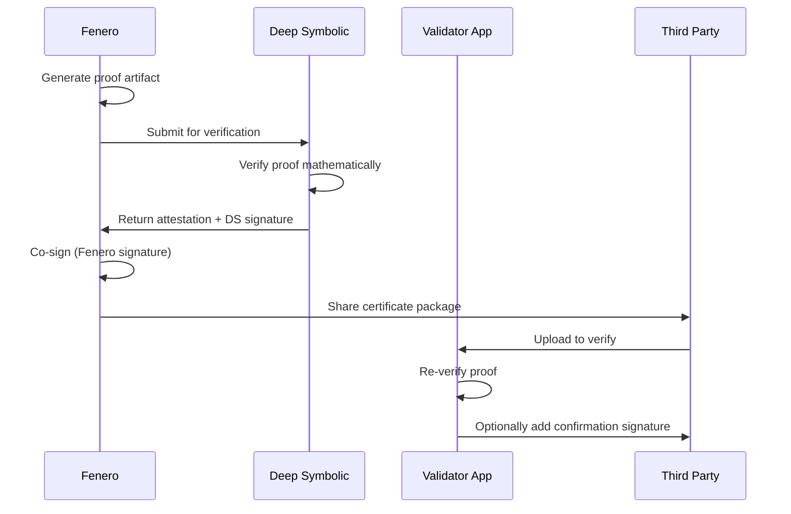
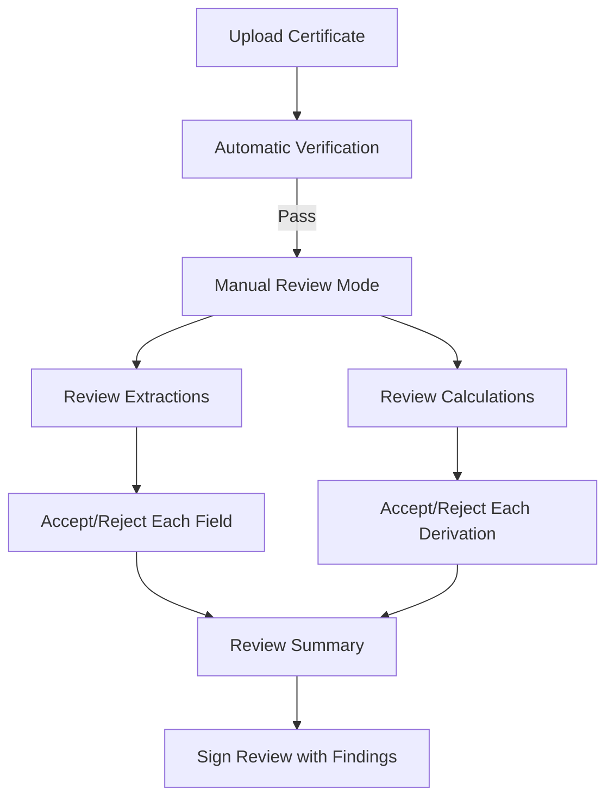
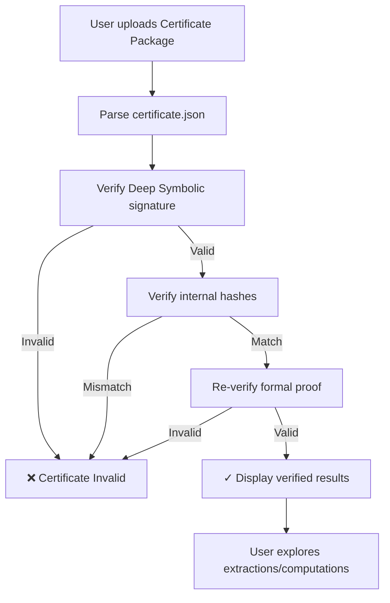

# Validator App & Shareable Certificates

**Status:** Draft for Discussion
**Last Updated:** 2026-01-04
**Owner:** Fenero

---

## Overview

The Validator App is a public-facing application that allows **any party** (regulators, auditors, counterparties) to independently verify Fenero computation results without accessing the source system.

**Key Concept:** Fenero produces a portable "Certificate Package" that can be shared with third parties. The Validator App verifies this package is authentic and unaltered.

---

## The Certificate Package

### What Gets Shared

A Certificate Package is a self-contained, portable proof bundle. **No raw documents (PDFs) are included** - only cryptographic evidence and metadata.

```
certificate-package/
├── certificate.json          # Core attestation + metadata
├── proof.bin                 # Formal proof artifact (Z3/Lean)
├── evidence/                 # Extraction evidence (NO raw documents)
│   ├── manifest.json         # List of extracted fields + hashes
│   ├── sources.json          # Document metadata (type, hash, page count)
│   └── extractions.json      # Field locations + value commitments
├── computations/             # What was calculated
│   ├── derivation-trace.json # Step-by-step calculation
│   └── formula-hashes.json   # Hash of formulas used (not content)
└── signatures/               # Chain of trust
    ├── extraction.sig        # Signed by data extractor
    ├── computation.sig       # Signed by compute engine
    ├── proof.sig             # Signed by SDK
    └── attestation.sig       # Signed by Deep Symbolic
```

**Key principle:** The certificate proves WHAT was extracted and HOW it was computed, without containing the actual documents or raw PII.

### Certificate JSON Structure

```json
{
  "certificate_id": "cert-550e8400-e29b-41d4",
  "version": "1.0",
  "issued_at": "2026-01-04T12:00:00Z",
  "expires_at": "2027-01-04T12:00:00Z",

  "subject": {
    "spec_name": "income_verification",
    "spec_version": "2025.1.0",
    "case_id": "CASE-12345",
    "tenant": "acme-lending"
  },

  "outcome": {
    "result": "APPROVED",
    "computed_values": {
      "income_stable": true,
      "dti_ratio": 0.32
    }
  },

  "verification": {
    "proof_valid": true,
    "verified_at": "2026-01-04T12:00:05Z",
    "verified_by": "Deep Symbolic v1.0"
  },

  "hashes": {
    "inputs": "sha256:abc123...",
    "formulas": "sha256:def456...",
    "outputs": "sha256:ghi789...",
    "proof": "sha256:jkl012..."
  },

  "signatures": {
    "attestation": "<base64:deep-symbolic-sig>",
    "certificate_chain": ["<cert1>", "<cert2>"]
  }
}
```

---

## Privacy Tiers

Different sharing scenarios require different privacy levels. **No tier includes raw documents.**

### Tier 1: Full Evidence (Internal Audit)

**Maximum detail** - for internal compliance/audit teams who can cross-reference with source systems

| Data | Included | Notes |
|------|----------|-------|
| Source document hashes | YES | Proves which docs were used |
| Document metadata | YES | Type, page count, timestamps |
| Extracted values | YES | Actual dollar amounts |
| Extraction evidence | YES | Field locations, confidence scores |
| Formulas | YES | Full formula definitions |
| Computation trace | YES | Step-by-step derivation |
| Proof artifact | YES | Formal proof |
| Attestation | YES | Deep Symbolic signature |

*Auditor can independently verify by requesting original docs from Fenero and matching hashes.*

### Tier 2: Partial Evidence (External Audit)

**Prove extraction without exposing values**

| Data | Included | Notes |
|------|----------|-------|
| Source document hashes | YES | Proves which docs were used |
| Document metadata | YES | Type, page count (no content) |
| Extracted values | COMMITTED | Hash commitments only |
| Extraction evidence | YES | Field locations, confidence scores |
| Formulas | HASHED | Prove formula identity |
| Computation trace | STRUCTURE | Show steps, not values |
| Proof artifact | YES | Still verifiable |
| Attestation | YES | Deep Symbolic signature |

*Verifier sees WHERE data came from and HOW it was computed, but not the actual values.*

### Tier 3: Outcome Only (Counterparty)

**Prove outcome without exposing anything**

| Data | Included | Notes |
|------|----------|-------|
| Source document hashes | NO | Not included |
| Document metadata | MINIMAL | Just document types |
| Extracted values | NO | Not included |
| Extraction evidence | NO | Not included |
| Formulas | HASHED | Prove formula identity |
| Computation trace | NO | Not included |
| Proof artifact | YES | Mathematically verifiable |
| Attestation | YES | "Computation correct" |
| Outcome only | YES | "APPROVED" / "DENIED" |

*Verifier only sees the result and proof that it was computed correctly.*

---

## Signature Chain & Multi-Party Verification

### How Verification Works

The certificate accumulates signatures as it moves through the verification chain:



### Signature Accumulation

Each party that verifies can optionally add their signature:

```json
{
  "signatures": {
    "chain": [
      {
        "signer": "deep-symbolic",
        "role": "proof_verifier",
        "signature": "<base64:ds-sig>",
        "signed_at": "2026-01-04T12:00:05Z",
        "statement": "Proof mathematically verified"
      },
      {
        "signer": "fenero",
        "role": "issuer",
        "signature": "<base64:fenero-sig>",
        "signed_at": "2026-01-04T12:00:06Z",
        "statement": "Certificate issued"
      },
      {
        "signer": "acme-lending",
        "role": "relying_party",
        "signature": "<base64:acme-sig>",
        "signed_at": "2026-01-04T14:30:00Z",
        "statement": "Independently verified via Validator App"
      },
      {
        "signer": "federal-regulator",
        "role": "auditor",
        "signature": "<base64:reg-sig>",
        "signed_at": "2026-01-15T09:00:00Z",
        "statement": "Audit confirmation"
      }
    ]
  }
}
```

### Verification Roles

| Role | Who | What They Attest |
|------|-----|------------------|
| `proof_verifier` | Deep Symbolic | "The math checks out" |
| `issuer` | Fenero | "We generated this certificate" |
| `relying_party` | Lender/Customer | "We verified and accept this" |
| `auditor` | Regulator/Auditor | "We reviewed and confirmed" |
| `witness` | Any third party | "We independently verified" |

### Adding a Confirmation Signature

When a third party verifies via the Validator App, they can optionally sign:

```
┌─────────────────────────────────────────────────────────────────┐
│  VALIDATOR APP - Verification Complete                          │
├─────────────────────────────────────────────────────────────────┤
│                                                                 │
│  ✓ Certificate VERIFIED                                         │
│                                                                 │
│  Existing Signatures:                                           │
│  ├── Deep Symbolic (proof_verifier) - 2026-01-04 12:00          │
│  └── Fenero (issuer) - 2026-01-04 12:00                         │
│                                                                 │
│  ┌─────────────────────────────────────────────────────────┐   │
│  │  Add Your Confirmation Signature                         │   │
│  │                                                          │   │
│  │  Organization: [Acme Lending LLC          ]              │   │
│  │  Role:         [relying_party ▼]                         │   │
│  │  Statement:    [Independently verified    ]              │   │
│  │                                                          │   │
│  │  [ Sign with Organization Key ]  [ Download Without ]    │   │
│  └─────────────────────────────────────────────────────────┘   │
│                                                                 │
└─────────────────────────────────────────────────────────────────┘
```

This creates an audit trail showing WHO verified WHEN, building trust through multiple independent confirmations.

---

## Evidence & Calculation Data Structures

The certificate package contains two key evidence types:
1. **Extraction Evidence** - What data was pulled from documents
2. **Calculation Evidence** - How outputs were derived from inputs

**Important:** The spec formulas themselves are Fenero IP and are NOT revealed. Only the structure, inputs, outputs, and rule citations are shown.

---

## Extraction Evidence

### Ontology System

Fenero uses a multi-layer ontology system for field extraction:

| Ontology Type | Coverage | Examples |
|---------------|----------|----------|
| **MISMO 3.4** | Standard mortgage documents | W-2, 1040, standard forms |
| **IRS Extended** | Tax schedules & business returns | Schedule C, Schedule E, K-1, 1065, 1120 |
| **Employment** | Verification forms | VOE (Fannie Mae 1005, Freddie Mac 65) |

Each ontology defines:
- **Elements**: Canonical field definitions with data types
- **Aliases**: Multiple names mapping to canonical fields (e.g., `line_13_depreciation` → `Line13_DepreciationAmount`)
- **IRS Line References**: Direct mapping to form line numbers

### Evidence Data Structure

```json
{
  "extraction_evidence": {
    "engine_version": "fenero-underwriter-engine-v0.1",
    "extracted_at": "2026-01-04T11:55:00Z",

    "ontologies_used": [
      {
        "name": "mismo_3.4",
        "version": "3.4.0",
        "document_types": ["IRSW2"]
      },
      {
        "name": "irs_schedule_c",
        "version": "2025.12",
        "document_types": ["IRSScheduleC"]
      },
      {
        "name": "verification_of_employment",
        "version": "2025.12",
        "document_types": ["VerificationOfEmployment"]
      }
    ],

    "sources": [
      {
        "document_id": "doc-abc123",
        "document_type": "IRSW2",
        "ontology": "mismo_3.4",
        "document_hash": "sha256:a1b2c3...",
        "tax_year": 2024,
        "page_count": 1,
        "employer_name_hash": "sha256:...",
        "received_at": "2026-01-04T11:50:00Z"
      },
      {
        "document_id": "doc-def456",
        "document_type": "IRSScheduleC",
        "ontology": "irs_schedule_c",
        "document_hash": "sha256:d4e5f6...",
        "tax_year": 2024,
        "page_count": 2,
        "received_at": "2026-01-04T11:50:00Z"
      },
      {
        "document_id": "doc-ghi789",
        "document_type": "VerificationOfEmployment",
        "ontology": "verification_of_employment",
        "document_hash": "sha256:g7h8i9...",
        "page_count": 1,
        "received_at": "2026-01-04T11:50:00Z"
      }
    ],

    "inputs": [
      {
        "field_id": "w2_wages_y1",
        "canonical_name": "WagesTipsOtherCompensationAmount",
        "display_name": "W-2 Wages (Box 1)",
        "value_hash": "sha256:...",
        "value_commitment": "pedersen:...",
        "data_type": "currency",
        "source": {
          "document_id": "doc-abc123",
          "ontology": "mismo_3.4",
          "location": {
            "box_label": "Box 1",
            "ontology_path": "TAX_DOCUMENT/TAX_DOCUMENT_DETAIL/WagesTipsOtherCompensationAmount",
            "coordinates": {"x": 450, "y": 180, "w": 120, "h": 24}
          },
          "confidence": 0.98
        }
      },
      {
        "field_id": "schedule_c_depreciation",
        "canonical_name": "Line13_DepreciationAmount",
        "display_name": "Schedule C Depreciation (Line 13)",
        "value_hash": "sha256:...",
        "value_commitment": "pedersen:...",
        "data_type": "currency",
        "source": {
          "document_id": "doc-def456",
          "ontology": "irs_schedule_c",
          "location": {
            "irs_line": "13",
            "element_name": "Line13_DepreciationAmount",
            "aliases": ["line_13_depreciation", "depreciation"],
            "coordinates": {"x": 520, "y": 340, "w": 100, "h": 20}
          },
          "confidence": 0.97
        }
      },
      {
        "field_id": "schedule_c_net_profit",
        "canonical_name": "Line31_NetProfitLossAmount",
        "display_name": "Schedule C Net Profit (Line 31)",
        "value_hash": "sha256:...",
        "value_commitment": "pedersen:...",
        "data_type": "currency",
        "source": {
          "document_id": "doc-def456",
          "ontology": "irs_schedule_c",
          "location": {
            "irs_line": "31",
            "element_name": "Line31_NetProfitLossAmount",
            "aliases": ["line_31_net_profit", "net_profit"],
            "coordinates": {"x": 520, "y": 680, "w": 100, "h": 20}
          },
          "confidence": 0.99
        }
      },
      {
        "field_id": "voe_ytd_base",
        "canonical_name": "ytd_base_earnings",
        "display_name": "VOE YTD Base Earnings",
        "value_hash": "sha256:...",
        "value_commitment": "pedersen:...",
        "data_type": "currency",
        "source": {
          "document_id": "doc-ghi789",
          "ontology": "verification_of_employment",
          "location": {
            "section": "Prior Year Earnings History",
            "element_name": "ytd_base_earnings",
            "aliases": ["ytd_base", "ytd_salary"],
            "coordinates": {"x": 320, "y": 95, "w": 80, "h": 20}
          },
          "confidence": 0.96
        }
      }
    ]
  }
}
```

### Extraction Evidence Fields

| Field | Purpose |
|-------|---------|
| `field_id` | Internal spec input identifier |
| `canonical_name` | Ontology element name (e.g., `Line13_DepreciationAmount`) |
| `display_name` | Human-readable label |
| `value_hash` | SHA-256 of extracted value |
| `value_commitment` | Pedersen commitment for ZK verification |
| `ontology` | Which ontology defines this field (MISMO, IRS, Employment) |
| `ontology_path` | Full path in MISMO schema (if applicable) |
| `irs_line` | IRS form line number (for tax documents) |
| `element_name` | Canonical ontology element name |
| `aliases` | Alternative field names that map to canonical |
| `coordinates` | Pixel location for bounding box display |
| `confidence` | Extraction confidence score |

### Supported Document Types

| Category | Document Type | Ontology |
|----------|---------------|----------|
| **Tax - W-2** | `IRSW2` | MISMO 3.4 |
| **Tax - 1040** | `IRS1040` | MISMO 3.4 + IRS Extended |
| **Tax - Schedule C** | `IRSScheduleC` | `irs_schedule_c` |
| **Tax - Schedule E** | `IRSScheduleE` | `irs_schedule_e` |
| **Tax - Schedule K-1 (1065)** | `IRSScheduleK1Form1065` | `schedule_k1_form_1065` |
| **Tax - Schedule K-1 (1120S)** | `IRSScheduleK1Form1120S` | `schedule_k1_form_1120s` |
| **Tax - Form 1065** | `IRS1065` | `irs_1065` |
| **Tax - Form 1120** | `IRS1120` | `irs_1120` |
| **Tax - Form 1120S** | `IRS1120S` | `irs_1120s` |
| **Employment** | `VerificationOfEmployment` | `verification_of_employment` |
| **Pay Stub** | `PayStub` | Employment extension |

### Validator App Evidence View

```
┌─────────────────────────────────────────────────────────────────┐
│  VALIDATOR APP - Extraction Evidence                            │
├─────────────────────────────────────────────────────────────────┤
│                                                                 │
│  Source Document: W-2 (2024)              Hash: sha256:a1b2c3.. │
│  Document ID: doc-abc123                  Pages: 1              │
│  Extractor: fenero-underwriter-engine-v0.1                      │
│                                                                 │
│  Extracted Fields:                                              │
│  ┌─────────────────────────────────────────────────────────┐   │
│  │ Field            │ Location  │ Confidence │ Hash        │   │
│  ├──────────────────┼───────────┼────────────┼─────────────┤   │
│  │ wages_tips       │ Box 1     │ 98%        │ ✓ Verified  │   │
│  │ federal_tax_wh   │ Box 2     │ 97%        │ ✓ Verified  │   │
│  │ social_security  │ Box 3     │ 99%        │ ✓ Verified  │   │
│  │ employer_ein     │ Box b     │ 95%        │ ✓ Verified  │   │
│  └─────────────────────────────────────────────────────────┘   │
│                                                                 │
│  [ Upload Document to View Bounding Boxes ]                     │
│                                                                 │
│  [View Computation Trace]  [View Signature Chain]               │
│                                                                 │
└─────────────────────────────────────────────────────────────────┘
```

*Note: Actual values only shown if Tier 1 certificate. Otherwise shows "COMMITTED" with hash.*

### Optional: Upload Document for Visual Verification

Users can optionally upload the original document to visually see the bounding boxes where data was extracted:

```
┌─────────────────────────────────────────────────────────────────┐
│  VALIDATOR APP - Visual Extraction Verification                 │
├─────────────────────────────────────────────────────────────────┤
│                                                                 │
│  Document uploaded: w2-2024.pdf                                 │
│  Hash match: ✓ sha256:a1b2c3.. matches certificate              │
│                                                                 │
│  ┌─────────────────────────────────┐  Field: wages_tips         │
│  │  [Document Preview]              │                           │
│  │                                  │  Location: Box 1          │
│  │      ┌────────────┐              │  Coordinates: (450,180)   │
│  │      │ $65,432.00 │◄── Bounding  │  Confidence: 98%          │
│  │      └────────────┘    Box       │                           │
│  │                                  │  ✓ Position verified      │
│  │                                  │  ✓ Hash verified          │
│  └─────────────────────────────────┘                            │
│                                                                 │
│  ⚠️  Document processed locally - never uploaded to any server  │
│                                                                 │
│  [Previous Field]  [Next Field]  [Remove Document]              │
│                                                                 │
└─────────────────────────────────────────────────────────────────┘
```

**Important:** Document upload is entirely client-side:
- Document **never leaves** the user's browser
- Hash is computed locally and compared to certificate
- Bounding boxes are rendered as overlays on the PDF
- No server upload - works offline

---

## Calculation Evidence

### Calculation Data Structure

The calculation evidence shows HOW outputs were derived from inputs, without revealing the actual spec formulas (which are Fenero IP).

```json
{
  "calculation_evidence": {
    "engine_version": "fenero-underwriter-engine-v0.1",
    "spec_name": "employment_wages",
    "spec_version": "v1.fnma.2025",
    "spec_hash": "sha256:...",
    "computed_at": "2026-01-04T11:55:30Z",

    "derivations": [
      {
        "derivation_id": "base_pay_annualized",
        "display_name": "Annualized Base Pay",
        "description": "Current base pay projected to annual",
        "inputs_used": ["ytd_base", "months_employed_ytd"],
        "output_hash": "sha256:...",
        "output_commitment": "pedersen:...",
        "data_type": "currency",
        "formula_hash": "sha256:...",
        "formula_description": "YTD base divided by months, multiplied by 12",
        "rule_citation": "FNMA B3-3.1-01: Projecting YTD income"
      },
      {
        "derivation_id": "overtime_annualized",
        "display_name": "Annualized Overtime",
        "description": "Average overtime projected to annual",
        "inputs_used": ["ytd_overtime", "months_employed_ytd"],
        "output_hash": "sha256:...",
        "output_commitment": "pedersen:...",
        "data_type": "currency",
        "formula_hash": "sha256:...",
        "formula_description": "YTD overtime averaged over months employed",
        "rule_citation": "FNMA B3-3.1-03: Overtime income treatment"
      },
      {
        "derivation_id": "total_qualifying_income",
        "display_name": "Total Qualifying Income",
        "description": "Sum of all qualifying income components",
        "inputs_used": ["base_pay_annualized", "overtime_annualized", "bonus_averaged"],
        "output_hash": "sha256:...",
        "output_commitment": "pedersen:...",
        "data_type": "currency",
        "formula_hash": "sha256:...",
        "formula_description": "Sum of annualized base, overtime, and averaged bonus"
      }
    ],

    "rules_applied": [
      {
        "rule_id": "overtime_2yr_history",
        "display_name": "Overtime History Requirement",
        "description": "Overtime requires 2-year history to qualify",
        "citation": "FNMA B3-3.1-03",
        "inputs_checked": ["overtime_history_months"],
        "result": "PASSED",
        "result_hash": "sha256:...",
        "threshold_description": "History >= 24 months"
      },
      {
        "rule_id": "income_stability",
        "display_name": "Income Stability Check",
        "description": "Year-over-year income must not decline > 5%",
        "citation": "FNMA B3-3.1-01",
        "inputs_checked": ["current_year_income", "prior_year_income"],
        "result": "PASSED",
        "result_hash": "sha256:...",
        "threshold_description": "YoY change >= -5%"
      }
    ],

    "outputs": [
      {
        "output_id": "qualifying_income",
        "display_name": "Qualifying Income",
        "derivation_source": "total_qualifying_income",
        "value_hash": "sha256:...",
        "value_commitment": "pedersen:...",
        "data_type": "currency"
      },
      {
        "output_id": "income_stable",
        "display_name": "Income Stable",
        "derivation_source": "income_stability",
        "value_hash": "sha256:...",
        "data_type": "boolean"
      }
    ],

    "outcome": {
      "outcome_id": "employment_wages_qualified",
      "display_name": "Employment Wages Qualification",
      "result": "QUALIFIED",
      "result_hash": "sha256:...",
      "conditions_met": ["overtime_2yr_history", "income_stability"],
      "summary": "Borrower qualifies based on employment wages"
    }
  }
}
```

### Calculation Evidence Fields

| Field | Purpose |
|-------|---------|
| `derivation_id` | Internal spec derivation identifier |
| `display_name` | Human-readable step name |
| `description` | Plain English explanation |
| `inputs_used` | Which inputs/derivations feed into this |
| `output_hash` | SHA-256 of computed result |
| `formula_hash` | Hash of formula (NOT the formula itself) |
| `formula_description` | Plain English description of calculation |
| `rule_citation` | FNMA/regulatory citation |
| `threshold_description` | Plain English threshold (not exact values) |

**Key principle:** The certificate shows WHAT was calculated and WHY (citations), but the actual CEL formulas in the spec remain hidden.

---

## Review & Accept/Reject Workflow

### Reviewer Actions

Users of the Validator App can review individual extractions and calculations, then accept or reject them:



### Extraction Review UI

```
┌─────────────────────────────────────────────────────────────────┐
│  VALIDATOR APP - Extraction Review                              │
├─────────────────────────────────────────────────────────────────┤
│                                                                 │
│  Document: W-2 (2024)                    Extractor: v0.1        │
│                                                                 │
│  ┌─────────────────────────────────────────────────────────────┐
│  │ FIELD: wages_tips_other_compensation                        │
│  │ Display: W-2 Wages (Box 1)                                  │
│  │ Location: Box 1 | Confidence: 98%                           │
│  │ MISMO Path: TAX_DOCUMENT/.../WagesTipsOtherCompensationAmt  │
│  │                                                             │
│  │ Value: $65,432.00  (Tier 1 only, otherwise shows hash)      │
│  │ Hash: sha256:a1b2c3d4...  ✓ Verified                        │
│  │                                                             │
│  │ ┌──────────────────────────────────────────────────────────┐│
│  │ │ [Upload W-2 to verify bounding box visually]             ││
│  │ └──────────────────────────────────────────────────────────┘│
│  │                                                             │
│  │  Reviewer Decision:                                         │
│  │  ○ Accept - Extraction is accurate                          │
│  │  ○ Reject - Extraction appears incorrect                    │
│  │                                                             │
│  │  Rejection Reason (if rejecting):                           │
│  │  ┌──────────────────────────────────────────────────────┐  │
│  │  │ [Optional: Note why extraction was rejected]         │  │
│  │  └──────────────────────────────────────────────────────┘  │
│  │                                                             │
│  │  [ ✓ Accept ]  [ ✗ Reject ]  [ Skip ]                       │
│  └─────────────────────────────────────────────────────────────┘
│                                                                 │
│  Progress: 3/12 fields reviewed                                 │
│  [← Previous]  [Next →]  [Review Summary]                       │
│                                                                 │
└─────────────────────────────────────────────────────────────────┘
```

### Calculation Review UI

```
┌─────────────────────────────────────────────────────────────────┐
│  VALIDATOR APP - Calculation Review                             │
├─────────────────────────────────────────────────────────────────┤
│                                                                 │
│  Spec: employment_wages (v1.fnma.2025)                          │
│                                                                 │
│  ┌─────────────────────────────────────────────────────────────┐
│  │ DERIVATION: base_pay_annualized                             │
│  │ Display: Annualized Base Pay                                │
│  │                                                             │
│  │ Description:                                                │
│  │   "YTD base divided by months, multiplied by 12"            │
│  │                                                             │
│  │ Inputs Used:                                                │
│  │   • ytd_base: $54,527.00  ✓ Extraction Verified             │
│  │   • months_employed_ytd: 11  ✓ Extraction Verified          │
│  │                                                             │
│  │ Output: $59,484.00                                          │
│  │ Hash: sha256:e5f6g7h8...  ✓ Matches Proof                   │
│  │                                                             │
│  │ Rule Citation: FNMA B3-3.1-01                               │
│  │   "Projecting YTD income to annual"                         │
│  │                                                             │
│  │  Reviewer Decision:                                         │
│  │  ○ Accept - Calculation logic is sound                      │
│  │  ○ Reject - Calculation appears incorrect                   │
│  │                                                             │
│  │  Rejection Reason (if rejecting):                           │
│  │  ┌──────────────────────────────────────────────────────┐  │
│  │  │ [e.g., "Formula description doesn't match FNMA rule"]│  │
│  │  └──────────────────────────────────────────────────────┘  │
│  │                                                             │
│  │  [ ✓ Accept ]  [ ✗ Reject ]  [ Skip ]                       │
│  └─────────────────────────────────────────────────────────────┘
│                                                                 │
│  ┌─────────────────────────────────────────────────────────────┐
│  │ RULE: income_stability                                      │
│  │ Display: Income Stability Check                             │
│  │                                                             │
│  │ Description:                                                │
│  │   "Year-over-year income must not decline > 5%"             │
│  │                                                             │
│  │ Citation: FNMA B3-3.1-01                                    │
│  │   "Income trending and stability analysis"                  │
│  │                                                             │
│  │ Inputs Checked:                                             │
│  │   • current_year_income: $65,432  ✓                         │
│  │   • prior_year_income: $58,200  ✓                           │
│  │                                                             │
│  │ Result: PASSED  (YoY change: +12.4%)                        │
│  │ Threshold: "YoY change >= -5%"                              │
│  │                                                             │
│  │  [ ✓ Accept ]  [ ✗ Reject ]  [ Skip ]                       │
│  └─────────────────────────────────────────────────────────────┘
│                                                                 │
│  Progress: 2/5 derivations, 1/2 rules reviewed                  │
│  [← Previous]  [Next →]  [Review Summary]                       │
│                                                                 │
└─────────────────────────────────────────────────────────────────┘
```

### Review Summary & Signature

After reviewing all items, the reviewer sees a summary and can sign their findings:

```
┌─────────────────────────────────────────────────────────────────┐
│  VALIDATOR APP - Review Summary                                 │
├─────────────────────────────────────────────────────────────────┤
│                                                                 │
│  Certificate: cert-550e8400-e29b-41d4                           │
│  Reviewed by: auditor@acme.com                                  │
│  Review Date: 2026-01-04 14:30:00                               │
│                                                                 │
│  ═══════════════════════════════════════════════════════════════│
│  EXTRACTION REVIEW                                              │
│  ═══════════════════════════════════════════════════════════════│
│  Total Fields: 12                                               │
│  ✓ Accepted: 11                                                 │
│  ✗ Rejected: 1                                                  │
│  ○ Skipped: 0                                                   │
│                                                                 │
│  Rejected:                                                      │
│  • federal_tax_withheld (Box 2) - "Value appears transposed"    │
│                                                                 │
│  ═══════════════════════════════════════════════════════════════│
│  CALCULATION REVIEW                                             │
│  ═══════════════════════════════════════════════════════════════│
│  Total Derivations: 5                                           │
│  ✓ Accepted: 5                                                  │
│  ✗ Rejected: 0                                                  │
│                                                                 │
│  Total Rules: 2                                                 │
│  ✓ Accepted: 2                                                  │
│  ✗ Rejected: 0                                                  │
│                                                                 │
│  ═══════════════════════════════════════════════════════════════│
│  OVERALL STATUS                                                 │
│  ═══════════════════════════════════════════════════════════════│
│                                                                 │
│  ⚠️  PARTIAL ACCEPTANCE                                         │
│                                                                 │
│  Reviewer Notes:                                                │
│  ┌──────────────────────────────────────────────────────────┐  │
│  │ One extraction flagged for manual review. Recommend      │  │
│  │ re-extraction of W-2 Box 2 field before final approval.  │  │
│  └──────────────────────────────────────────────────────────┘  │
│                                                                 │
│  ┌──────────────────────────────────────────────────────────┐  │
│  │  Sign Review Findings                                     │  │
│  │                                                           │  │
│  │  Role: [auditor ▼]                                        │  │
│  │  Statement: "Review completed with noted exceptions"      │  │
│  │                                                           │  │
│  │  [ Sign & Add to Certificate ]  [ Export as PDF Report ]  │  │
│  └──────────────────────────────────────────────────────────┘  │
│                                                                 │
└─────────────────────────────────────────────────────────────────┘
```

### Review Signature Structure

When a reviewer signs their findings, it's added to the signature chain:

```json
{
  "signatures": {
    "chain": [
      {
        "signer": "deep-symbolic",
        "role": "proof_verifier",
        "signature": "<base64:ds-sig>",
        "signed_at": "2026-01-04T12:00:05Z",
        "statement": "Proof mathematically verified"
      },
      {
        "signer": "fenero",
        "role": "issuer",
        "signature": "<base64:fenero-sig>",
        "signed_at": "2026-01-04T12:00:06Z",
        "statement": "Certificate issued"
      },
      {
        "signer": "auditor@acme.com",
        "role": "auditor",
        "signature": "<base64:auditor-sig>",
        "signed_at": "2026-01-04T14:30:00Z",
        "statement": "Review completed with noted exceptions",
        "review_summary": {
          "extractions_accepted": 11,
          "extractions_rejected": 1,
          "calculations_accepted": 7,
          "calculations_rejected": 0,
          "overall_status": "PARTIAL_ACCEPTANCE",
          "rejections": [
            {
              "item_type": "extraction",
              "item_id": "federal_tax_withheld",
              "reason": "Value appears transposed"
            }
          ]
        }
      }
    ]
  }
}
```

---

## Computation Trace

### Derivation Display

Show how outputs were computed from inputs:

```
┌─────────────────────────────────────────────────────────────────┐
│  VALIDATOR APP - Computation Trace                              │
├─────────────────────────────────────────────────────────────────┤
│                                                                 │
│  Spec: income_stability (v2025.1.0)                             │
│                                                                 │
│  STEP 1: Extract Inputs                                         │
│  ├── y1 (current_year_income) = $65,432  [from W-2 Box 1]       │
│  └── y2 (prior_year_income)   = $58,200  [from W-2 Box 1]       │
│                                                                 │
│  STEP 2: Calculate pct_change                                   │
│  │   Formula: (y1 - y2) / y2                                    │
│  │   = ($65,432 - $58,200) / $58,200                            │
│  │   = $7,232 / $58,200                                         │
│  └── = 0.1242 (12.42% increase)                                 │
│                                                                 │
│  STEP 3: Evaluate is_stable                                     │
│  │   Formula: pct_change >= -0.05                               │
│  │   = 0.1242 >= -0.05                                          │
│  └── = TRUE                                                     │
│                                                                 │
│  FINAL OUTCOME: STABLE ✓                                        │
│                                                                 │
│  [Proof Status: VERIFIED by Deep Symbolic]                      │
│                                                                 │
└─────────────────────────────────────────────────────────────────┘
```

---

## Validator App Features

### Core Verification Flow



### App Screens

1. **Upload Screen**
   - Drag & drop certificate package (.zip or .cert)
   - Paste certificate JSON directly
   - Scan QR code (for mobile)

2. **Verification Status**
   - Real-time verification progress
   - Signature check ✓
   - Hash verification ✓
   - Proof verification ✓

3. **Results Overview**
   - Outcome (APPROVED/DENIED)
   - Spec name and version
   - Issue/expiry dates
   - Verification timestamp

4. **Extraction Explorer** (if Tier 1/2)
   - Source document metadata (type, hash)
   - Field-by-field evidence (locations, confidence)
   - Hash verification status
   - Optional: Upload document to view bounding boxes visually

5. **Computation Trace** (if Tier 1/2)
   - Step-by-step derivation
   - Formula explanations
   - Intermediate values

6. **Signature Chain**
   - Visual certificate chain
   - Click to inspect each signature
   - Links to public keys

---

## Deployment Options

### Option A: Fenero-Hosted (SaaS)

```
https://verify.fenero.com
```

- Fenero operates the validator
- Anyone can upload and verify
- Branding: Fenero + Deep Symbolic

### Option B: Self-Hosted

Validator as a static web app or container:

```yaml
# values.yaml
image:
  repository: fenero/validator-app
  tag: "1.0.0"

ingress:
  enabled: true
  host: verify.customer.com
```

- Customer deploys in their infrastructure
- Full control over access
- Air-gapped capable (no external calls needed)

### Option C: Embedded Widget

```html
<script src="https://fenero.com/validator-widget.js"></script>
<fenero-validator certificate-url="/path/to/cert.json" />
```

- Embed in customer portals
- Iframe or web component
- Customizable styling

---

## Security Considerations

### What the Validator App Needs

| Requirement | On-Premise | SaaS |
|-------------|------------|------|
| Deep Symbolic public key | Bundled | Bundled |
| Z3 solver (for re-verification) | Optional | Optional |
| Network access | None | None |
| User authentication | Optional | Optional |

### What the Validator App NEVER Needs

- Access to Fenero systems
- Access to Deep Symbolic API
- Access to source documents (never in package)
- Any secrets or private keys

### Offline Verification

The entire verification can happen offline:

1. Signature verification: Uses bundled public keys
2. Hash verification: Pure computation
3. Proof re-verification: Runs Z3 locally (optional)

---

## QR Code / Short Links

For easy sharing, generate short verification links:

```
Certificate ID: cert-550e8400-e29b-41d4
Short URL: https://verify.fenero.com/c/X7kM2p

QR Code: [████████████]
         [██      ████]
         [██  ██  ████]
         [████████████]
```

Scanning takes you directly to the verification result (if certificate is uploaded to Fenero's public registry, or prompts for upload).

---

## Open Questions

### Privacy & Sharing

- [ ] Who decides which privacy tier to use? (Fenero admin, per-case?)
- [ ] Can recipients "upgrade" tier if they have authorization?
- [ ] Should certificates expire? (Default: 1 year)
- [ ] How do third parties register their signing keys for confirmation signatures?

### Technical

- [ ] Certificate package format: ZIP, single JSON, or custom format?
- [ ] Should we support partial verification (signature only, no proof re-run)?
- [ ] Mobile app or web-only?
- [ ] Offline-first PWA?

### Business

- [ ] Is Validator App free to use?
- [ ] Do we charge for certificate generation?
- [ ] White-label options for enterprise customers?

---

## Example Use Cases

### Use Case 1: Mortgage Lender to Investor

1. Lender runs income verification through Fenero
2. Fenero generates Tier 3 certificate (outcome only)
3. Lender shares certificate with loan package
4. Investor opens Validator App, uploads certificate
5. Investor sees: "VERIFIED: Income Stable = TRUE"
6. Investor trusts outcome without seeing PII

### Use Case 2: Internal Audit

1. Compliance team requests full audit trail
2. Fenero generates Tier 1 certificate (full evidence)
3. Auditor opens Validator App with certificate
4. Auditor sees: All extraction evidence, values, computations
5. Auditor reviews each field's source location and confidence
6. Auditor can request original docs from Fenero, verify hashes match
7. Auditor adds their confirmation signature to the certificate

### Use Case 3: Regulatory Examination

1. Regulator requests sample cases
2. Fenero generates Tier 2 certificates (partial evidence)
3. Regulator opens Validator App
4. Regulator sees: Document types, field locations, confidence scores
5. Regulator verifies extraction came from correct form fields
6. Regulator verifies computation structure is correct
7. Actual values remain hidden (hash commitments only)
8. Regulator adds audit signature to certificate chain
